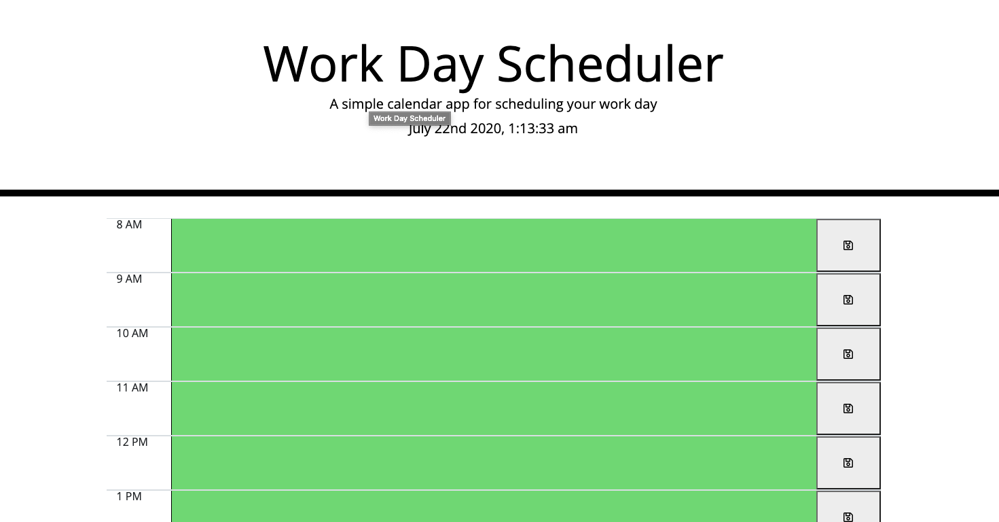

# Day-Planner-Powered-by-jQuery
This is a simple to use Day planner that is powerd by jQuery that allows the user to:

-See the current time and date in their timezone.

-The user sees time slots for all hours of the day.

-The user can click on a time slot to add a a new reminder. 

-The time slot is color cordinated indicating if the time is in the past, present, or future.

-The data the user inputs will be saved even after the paged is refreshed or closed highlight the applications data storing features 

-This simple interface is showcased  with HTML, CSS and jQuery for a smooth and user freindly experience 

